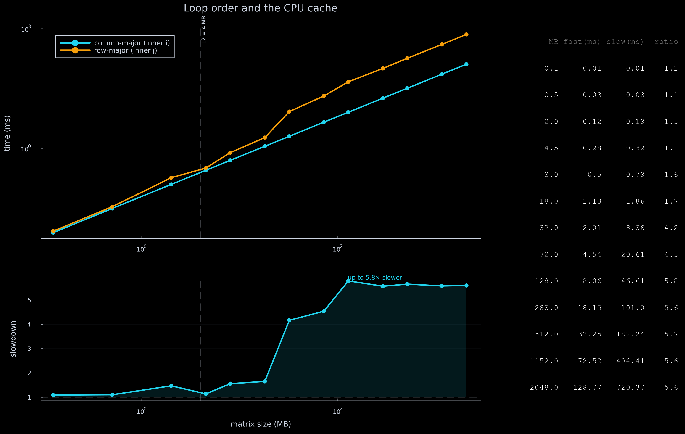

# Cache order

Julia stores matrices **column-major** — `A[i, j]` sits next to `A[i+1, j]` in memory.
So when you sum a matrix, the loop order matters:

- **inner loop `i`** (column-major) walks memory in order → uses each cache line fully.
- **inner loop `j`** (row-major) jumps a full column every step → mostly cache misses.

Same array, same additions, only the loop order changes. This benchmarks both from
0.1 MB up to a 2 GB matrix.



## What it shows

- While the matrix fits in cache, order barely matters (~1×).
- Once it outgrows the last cache level, the row-major loop misses on almost every
  access → up to ~5.8× slower.
- The gap then plateaus: both loops become limited by raw memory bandwidth, so their
  ratio settles to a constant set by how much of each cache line actually gets used.

## Run

```bash
julia --project=. loop_order_benchmark.jl
```

Writes `cache_order.png`.
